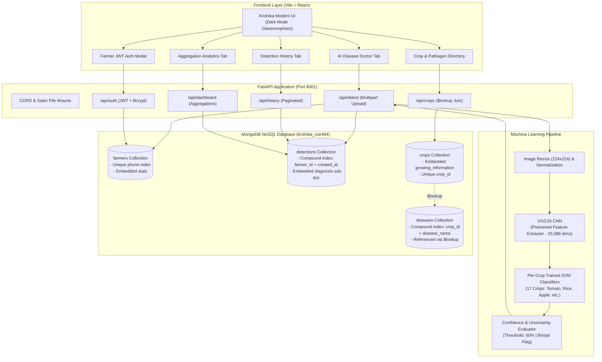
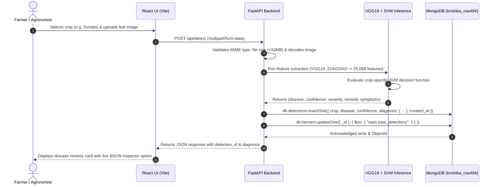

# Krishika AI — System Architecture & Data Flow Diagrams

## 1. Full-Stack End-to-End Application Architecture

```mermaid
graph TB
    subgraph Client ["Frontend Layer (Vite + React)"]
        UI["Krishika Modern UI<br/>(Dark Mode Glassmorphism)"]
        Diagnose["AI Disease Doctor Tab"]
        History["Detection History Tab"]
        Dashboard["Aggregation Analytics Tab"]
        Encyclopedia["Crop & Pathogen Directory"]
        AuthModal["Farmer JWT Auth Modal"]
    end

    subgraph API_Gateway ["FastAPI Application (Port 8001)"]
        CORS["CORS & Static File Mounts"]
        AuthRouter["/api/auth (JWT + Bcrypt)"]
        DetectRouter["/api/detect (Multipart Upload)"]
        HistoryRouter["/api/history (Paginated)"]
        DashRouter["/api/dashboard (Aggregations)"]
        CropsRouter["/api/crops ($lookup Join)"]
    end

    subgraph ML_Engine ["Machine Learning Pipeline"]
        Preprocess["Image Resize (224x224) & Normalization"]
        VGG19["VGG19 CNN<br/>(Pretrained Feature Extractor - 25,088 dims)"]
        SVM_Models["Per-Crop Trained SVM Classifiers<br/>(17 Crops: Tomato, Rice, Apple, etc.)"]
        DecisionRules["Confidence & Uncertainty Evaluator<br/>(Threshold: 60% | Brinjal Flag)"]
    end

    subgraph Database ["MongoDB NoSQL Database (krishika_cse494)"]
        FarmersColl[("farmers Collection<br/>- Unique phone index<br/>- Embedded stats")]
        DetectionsColl[("detections Collection<br/>- Compound index: farmer_id + created_at<br/>- Embedded diagnosis sub-doc")]
        CropsColl[("crops Collection<br/>- Embedded growing_information<br/>- Unique crop_id")]
        DiseasesColl[("diseases Collection<br/>- Compound index: crop_id + disease_name<br/>- Referenced via $lookup")]
    end

    UI --> Diagnose & History & Dashboard & Encyclopedia & AuthModal
    Diagnose --> DetectRouter
    History --> HistoryRouter
    Dashboard --> DashRouter
    Encyclopedia --> CropsRouter
    AuthModal --> AuthRouter

    DetectRouter --> Preprocess
    Preprocess --> VGG19
    VGG19 --> SVM_Models
    SVM_Models --> DecisionRules
    DecisionRules --> DetectRouter

    DetectRouter --> DetectionsColl
    DetectRouter --> FarmersColl
    HistoryRouter --> DetectionsColl
    DashRouter --> DetectionsColl
    CropsRouter --> CropsColl
    CropsColl -.->|"$lookup"| DiseasesColl
    AuthRouter --> FarmersColl
```

## 2. Detection & Diagnosis Lifecycle Flow

```mermaid
sequenceDiagram
    autonumber
    actor Farmer as Farmer / Agronomist
    participant UI as React UI (Vite)
    participant API as FastAPI Backend
    participant ML as VGG19 + SVM Inference
    participant DB as MongoDB (krishika_cse494)

    Farmer->>UI: Selects crop (e.g. Tomato) & uploads leaf image
    UI->>API: POST /api/detect (multipart/form-data)
    API->>API: Validates MIME type, file size (<10MB) & decodes image
    API->>ML: Run feature extraction (VGG19: 224x224x3 -> 25,088 features)
    ML->>ML: Evaluate crop-specific SVM decision function
    ML-->>API: Returns (disease, confidence, severity, remedy, symptoms)
    API->>DB: db.detections.insertOne({ crop, disease, confidence, diagnosis: { ... }, created_at })
    API->>DB: db.farmers.updateOne({ _id }, { $inc: { "stats.total_detections": 1 } })
    DB-->>API: Acknowledged write & ObjectId
    API-->>UI: Returns JSON response with detection_id & diagnosis
    UI-->>Farmer: Displays disease remedy card with live BSON inspector option
```
